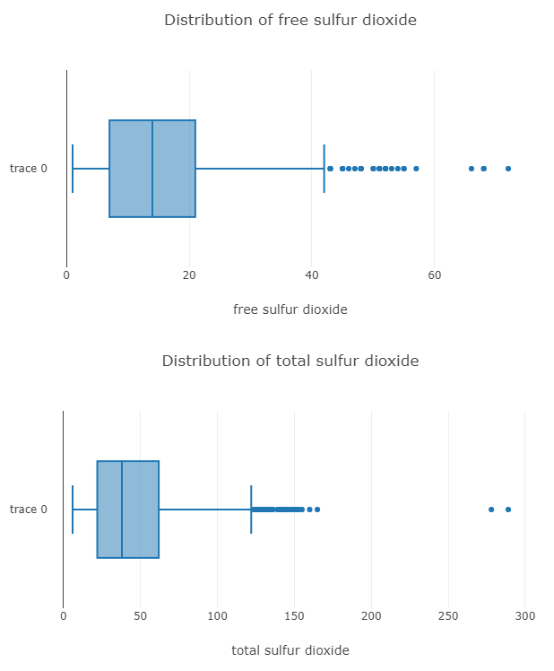
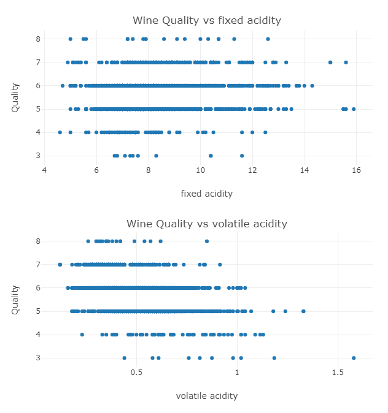
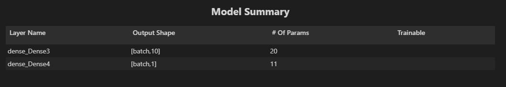

## Predicting RedWine Quality using TensorflowJS and GridDB

In this article, we will be using TensorFlowJS and GridDB to train a model and predict the Quality of RedWine.
For this tutorial we will be using the following Libraries for NodeJS.

* TensorflowJS - For training models
* DanfoJS - For working with DataFrames

It is useful to work with Node Notebooks for this as they make experimenting with Data Science and ML easier. Visual Studio Code is a great editor that supports Node Notebooks and we are going to use it for this article. Note: For Danfo JS and Tensorflow JS we need at least node version 12 where as griddb works on node version 10.

```javascript
const dfd = require("danfojs-node")
var fs     = require('fs');
const tf = dfd.tensorflow
const tfvis = require('@tensorflow/tfjs-vis')
```

The Dataset used will be from [This Kaggle Dataset](https://www.kaggle.com/datasets/midouazerty/redwine)

We will start with loading our dataset into a CSV and inserting into GridDB.

## Loading Data into GridDB and then Fetching Data from GridDB
First we connect to the GridDB Server.  We have it running on the same machine(localhost).
```javascript
var griddb = require('griddb_node');

const createCsvWriter = require('csv-writer').createObjectCsvWriter;
const csvWriter = createCsvWriter({
  path: 'out.csv',
  header: [
    {id: "fixed acidity", title:"fixed acidity"}, 
    {id: "volatile acidity", title:"volatile acidity"}, 
    {id: "citric acid", title:"citric acid"}, 
    {id: "residual sugar", title:"residual sugar"}, 
    {id: "chlorides", title:"chlorides"}, 
    {id: "free sulfur dioxide", title:"free sulfur dioxide"}, 
    {id: "total sulfur dioxide" , title:"total sulfur dioxide"}, 
    {id: "density", title:"density"}, 
    {id: "pH", title:"pH"}, 
    {id: "sulphates", title:"sulphates"}, 
    {id: "alcohol", title:"alcohol"}, 
    {id: "quality", title:"quality"} 
  ]
});

const factory = griddb.StoreFactory.getInstance();
const store = factory.getStore({
    "host": '239.0.0.1',
    "port": 31999,
    "clusterName": "defaultCluster",
    "username": "admin",
    "password": "admin"
});
// For connecting to the GridDB Server we have to make containers and specify the schema.
const conInfo = new griddb.ContainerInfo({
    'name': "redwinequality",
    'columnInfoList': [
      ["name", griddb.Type.STRING],
      ["fixedacidity", griddb.Type.DOUBLE],
      ["volatileacidity", griddb.Type.DOUBLE],
      ["citricacid", griddb.Type.DOUBLE],
      ["residualsugar", griddb.Type.DOUBLE],
      ["chlorides", griddb.Type.DOUBLE],
      ["freesulfurdioxide", griddb.Type.INTEGER],
      ["totalsulfurdioxide", griddb.Type.INTEGER],
      ["density", griddb.Type.DOUBLE],
      ["pH", griddb.Type.DOUBLE],
      ["sulphates", griddb.Type.DOUBLE],
      ["alcohol", griddb.Type.DOUBLE],
      ["quality", griddb.Type.INTEGER],
    ],
    'type': griddb.ContainerType.COLLECTION, 'rowKey': true
});


// ////////////////////////////////////////////


const csv = require('csv-parser');

const fs = require('fs');
var lst = []
var lst2 = []
var i =0;
fs.createReadStream('./dataset/winequality-red.csv')
  .pipe(csv())
  .on('data', (row) => {
    lst.push(row);
  })
  .on('end', () => {

    var container;
    var idx = 0;
    
    for(let i=0;i<lst.length;i++){
        lst[i]["fixed acidity"] = parseFloat(lst[i]["fixed acidity"])

        lst[i]['volatile acidity'] = parseFloat(lst[i]["volatile acidity"])
        lst[i]['citric acid'] = parseFloat(lst[i]["citric acid"])
        lst[i]['residual sugar'] = parseFloat(lst[i]["residual sugar"])
        lst[i]['chlorides'] = parseFloat(lst[i]["chlorides"])
        lst[i]['free sulfur dioxide'] = parseInt(lst[i]["free sulfur dioxide"])
        lst[i]['total sulfur dioxide'] = parseInt(lst[i]["total sulfur dioxide"])
        lst[i]['density'] = parseFloat(lst[i]["density"])
        lst[i]['pH'] = parseFloat(lst[i]["pH"])
        lst[i]['sulphates'] = parseFloat(lst[i]["sulphates"])
        lst[i]['alcohol'] = parseFloat(lst[i]["alcohol"])
        lst[i]['quality'] = parseFloat(lst[i]["quality"])


        console.log(parseFloat(lst[i]["fixed acidity"]))
    store.putContainer(conInfo, false)
        .then(cont => {
            container = cont;
            return container.createIndex({ 'columnName': 'name', 'indexType': griddb.IndexType.DEFAULT });
        })
        .then(() => {
            idx++;
            container.setAutoCommit(false);
            return container.put([String(idx), lst[i]['fixed acidity'],lst[i]["volatile acidity"],lst[i]["citric acid"],lst[i]["residual sugar"],lst[i]["chlorides"],lst[i]["free sulfur dioxide"],lst[i]["total sulfur dioxide"],lst[i]["density"],lst[i]["pH"],lst[i]["sulphates"],lst[i]["alcohol"],lst[i]["quality"]]);
        })
        .then(() => {
            return container.commit();
        })
       
        .catch(err => {
            if (err.constructor.name == "GSException") {
                for (var i = 0; i < err.getErrorStackSize(); i++) {
                    console.log("[", i, "]");
                    console.log(err.getErrorCode(i));
                    console.log(err.getMessage(i));
                }
            } else {
                console.log(err);
            }
        });
    }
    store.getContainer("redwinequality")
    .then(ts => {
        container = ts;
      query = container.query("select *")
      return query.fetch();
  })
  .then(rs => {
      while (rs.hasNext()) {
          let rsNext = rs.next();
          lst2.push(
            
                {
                    'fixed acidity': rsNext[1],
                    "volatile acidity": rsNext[2],
                    "citric acid": rsNext[3],
                    "residual sugar": rsNext[4],
                    "chlorides": rsNext[5],
                    "free sulfur dioxide": rsNext[6],
                    "total sulfur dioxide": rsNext[7],
                    "density": rsNext[8],
                    "pH": rsNext[9],
                    "sulphates": rsNext[10],
                    "alcohol": rsNext[11],
                    "quality": rsNext[12]
                
                }

              
            
            
          );
          
      }

      

        csvWriter
        .writeRecords(lst2)
        .then(()=> console.log('The CSV file was written successfully'));


      return 
  }).catch(err => {
      if (err.constructor.name == "GSException") {
          for (var i = 0; i < err.getErrorStackSize(); i++) {
              console.log("[", i, "]");
              console.log(err.getErrorCode(i));
              console.log(err.getMessage(i));
          }
      } else {
          console.log(err);
      }
  });   
    
  });
 
```


Then in the same code we fetch the data from GridDB and write it to a csv file. The reason why we did this was because the project file runs on node version 12 where as the griddb code runs on node version 10.
```javascript
let df = await dfd.readCSV("./out.csv")
```

We then read from the csv file in our node notebook and perform our Exploratory Data Analysis on it. After which we can move to preprocessing and modelling.


We have made a dataframe from the data we got from GridDB in a variable named `df`.

## Exploratory Data Analysis:

In the EDA phase, we check the data to get an idea of what the data looks like. The simplest thing to do is to check how many rows are there, what are the columns, and what are the data types of each of the columns.

Checking the shape of the dataframe. We have 1599 rows and 12 columns.
```javascript
console.log(df.shape)

//  Output
// [ 1599, 12 ]
```

Now checking the columns. We have different quantities given in each row, and then we the quality variable, which we are going to use as our target.
```
console.log(df.columns)

## Output
['fixed acidity','volatile acidity','citric acid','residual sugar','chlorides','free sulfur dioxide',
    'total sulfur dioxide','density','pH','sulphates','alcohol','quality']
```

The print function in danfoJS allows printing 10 rows at most, so printing the column types has to be done in two parts.
```javascript
df.loc({columns:['fixed acidity',
'volatile acidity',
'citric acid',
'residual sugar',
'chlorides',
'free sulfur dioxide','total sulfur dioxide',
'density']}).ctypes.print()

//  Output
// ╔══════════════════════╤═════════╗
// ║ fixed acidity        │ float32 ║
// ╟──────────────────────┼─────────╢
// ║ volatile acidity     │ float32 ║
// ╟──────────────────────┼─────────╢
// ║ citric acid          │ float32 ║
// ╟──────────────────────┼─────────╢
// ║ residual sugar       │ float32 ║
// ╟──────────────────────┼─────────╢
// ║ chlorides            │ float32 ║
// ╟──────────────────────┼─────────╢
// ║ free sulfur dioxide  │ int32   ║
// ╟──────────────────────┼─────────╢
// ║ total sulfur dioxide │ int32   ║
// ╟──────────────────────┼─────────╢
// ║ density              │ float32 ║
// ╚══════════════════════╧═════════╝
```

```javascript
df.loc({columns:['pH',
'sulphates',
'alcohol',
'quality']}).ctypes.print()

//  Output

// ╔═══════════╤═════════╗
// ║ pH        │ float32 ║
// ╟───────────┼─────────╢
// ║ sulphates │ float32 ║
// ╟───────────┼─────────╢
// ║ alcohol   │ float32 ║
// ╟───────────┼─────────╢
// ║ quality   │ int32   ║
// ╚═══════════╧═════════╝
```


We will now look at a summary of statistics for all the columns to check their minimums, maximums, means, standard deviations etc.

```javascript
df.loc({columns:['fixed acidity',
'volatile acidity',
'citric acid',
'residual sugar',
'chlorides',
'free sulfur dioxide','total sulfur dioxide',
'density']}).describe().round(2).print()

// Output
// ╔════════════╤═══════════════════╤═══════════════════╤═══════════════════╤═══════════════════╤═══════════════════╤═══════════════════╤═══════════════════╤═══════════════════╗
// ║            │ fixed acidity     │ volatile acidity  │ citric acid       │ residual sugar    │ chlorides         │ free sulfur dio…  │ total sulfur di…  │ density           ║
// ╟────────────┼───────────────────┼───────────────────┼───────────────────┼───────────────────┼───────────────────┼───────────────────┼───────────────────┼───────────────────╢
// ║ count      │ 1599              │ 1599              │ 1599              │ 1599              │ 1599              │ 1599              │ 1599              │ 1599              ║
// ╟────────────┼───────────────────┼───────────────────┼───────────────────┼───────────────────┼───────────────────┼───────────────────┼───────────────────┼───────────────────╢
// ║ mean       │ 8.32              │ 0.53              │ 0.27              │ 2.54              │ 0.09              │ 15.87             │ 46.47             │ 1                 ║
// ╟────────────┼───────────────────┼───────────────────┼───────────────────┼───────────────────┼───────────────────┼───────────────────┼───────────────────┼───────────────────╢
// ║ std        │ 1.74              │ 0.18              │ 0.19              │ 1.41              │ 0.05              │ 10.46             │ 32.9              │ 0                 ║
// ╟────────────┼───────────────────┼───────────────────┼───────────────────┼───────────────────┼───────────────────┼───────────────────┼───────────────────┼───────────────────╢
// ║ min        │ 4.6               │ 0.12              │ 0                 │ 0.9               │ 0.01              │ 1                 │ 6                 │ 0.99              ║
// ╟────────────┼───────────────────┼───────────────────┼───────────────────┼───────────────────┼───────────────────┼───────────────────┼───────────────────┼───────────────────╢
// ║ median     │ 7.9               │ 0.52              │ 0.26              │ 2.2               │ 0.08              │ 14                │ 38                │ 1                 ║
// ╟────────────┼───────────────────┼───────────────────┼───────────────────┼───────────────────┼───────────────────┼───────────────────┼───────────────────┼───────────────────╢
// ║ max        │ 15.9              │ 1.58              │ 1                 │ 15.5              │ 0.61              │ 72                │ 289               │ 1                 ║
// ╟────────────┼───────────────────┼───────────────────┼───────────────────┼───────────────────┼───────────────────┼───────────────────┼───────────────────┼───────────────────╢
// ║ variance   │ 3.03              │ 0.03              │ 0.04              │ 1.99              │ 0                 │ 109.41            │ 1082.1            │ 0                 ║
// ╚════════════╧═══════════════════╧═══════════════════╧═══════════════════╧═══════════════════╧═══════════════════╧═══════════════════╧═══════════════════╧═══════════════════╝
```

```javascript
df.loc({columns:['pH','sulphates','alcohol','quality']}).describe().round(2).print()

// Output
// ╔════════════╤═══════════════════╤═══════════════════╤═══════════════════╤═══════════════════╗
// ║            │ pH                │ sulphates         │ alcohol           │ quality           ║
// ╟────────────┼───────────────────┼───────────────────┼───────────────────┼───────────────────╢
// ║ count      │ 1599              │ 1599              │ 1599              │ 1599              ║
// ╟────────────┼───────────────────┼───────────────────┼───────────────────┼───────────────────╢
// ║ mean       │ 3.31              │ 0.66              │ 10.42             │ 5.64              ║
// ╟────────────┼───────────────────┼───────────────────┼───────────────────┼───────────────────╢
// ║ std        │ 0.15              │ 0.17              │ 1.07              │ 0.81              ║
// ╟────────────┼───────────────────┼───────────────────┼───────────────────┼───────────────────╢
// ║ min        │ 2.74              │ 0.33              │ 8.4               │ 3                 ║
// ╟────────────┼───────────────────┼───────────────────┼───────────────────┼───────────────────╢
// ║ median     │ 3.31              │ 0.62              │ 10.2              │ 6                 ║
// ╟────────────┼───────────────────┼───────────────────┼───────────────────┼───────────────────╢
// ║ max        │ 4.01              │ 2                 │ 14.9              │ 8                 ║
// ╟────────────┼───────────────────┼───────────────────┼───────────────────┼───────────────────╢
// ║ variance   │ 0.02              │ 0.03              │ 1.14              │ 0.65              ║
// ╚════════════╧═══════════════════╧═══════════════════╧═══════════════════╧═══════════════════╝
```

Now to visualize the distributions, we use box plots and histograms.

```javascript
## Distribution of Column Values
const { Plotly } = require('node-kernel');
let cols = df.columns
for(let i = 0; i < cols.length; i++)
{
    let data = [{
        x: df[cols[i]].values,
        type: 'box'}];
    let layout = {
        height: 400,
        width: 700,
        title: 'Distribution of '+cols[i],
        xaxis: {title: cols[i]}};
    // There is no HTML element named `myDiv`, hence the plot is displayed below.
    Plotly.newPlot('myDiv', data, layout);
}
```

And here is the box plot for two of the columns.


Now Plotting a Scatter Plot between Quality and the other Columns.

```javascript
## Scatter Plot between Wine Quality and Column
let cols = [...cols]
cols.pop('quality')
for(let i = 0; i < cols.length; i++)
{
    let data = [{
        x: df[cols[i]].values,
        y: df['quality'].values,
        type: 'scatter',
        mode: 'markers'}];
    let layout = {
        height: 400,
        width: 700,
        title: 'Red Wine Quality vs '+cols[i],
        xaxis: {title: cols[i]},
        yaxis: {title: 'Quality'}};
    // There is no HTML element named `myDiv`, hence the plot is displayed below.
    Plotly.newPlot('myDiv', data, layout);    
}
```

The plot for two example columns is below:


Looking at the plots we can say that these columns could be used to predict the quality of the wine and a model could definitely be made.

## Data Preprocessing:

Since our data is mostly tidy, we only need to drop any null values

```javascript
df_drop = df.dropNa({ axis: 0 }).loc({columns:['quality','density']})
```

## Model

We will create a simple Neural Network with one input layer and one output layer

```javascript
function createModel() {
    // Create a sequential model
    const model = tf.sequential();
  
    // Add a single input layer
    model.add(tf.layers.dense({inputShape: [1], units: 10, useBias: true}));
  
    // Add an output layer
    model.add(tf.layers.dense({units: 1, useBias: true}));
  
    return model;
}
// Create the model
const model = createModel();
tfvis.show.modelSummary({name: 'Model Summary'}, model);
```

The Model Summary we get shows the layers and the number of neurons in each layer


Now that we have created our model, we need to convert our data into a tensor format for tensorflow to be able to train the model on it.

```javascript
function convertToTensor(data) {
    // Wrapping these calculations in a tidy will dispose any
    // intermediate tensors.
  
    return tf.tidy(() => {
      // Step 1. Shuffle the data
      tf.util.shuffle(data);
  
      // Step 2. Convert data to Tensor
      const inputs = data.map(d => d[0]);
      const labels = data.map(d => d[1]);
      // console.log(inputs);
      // console.log(data);
  
      const inputTensor = tf.tensor2d(inputs, [inputs.length, 1]);
      const labelTensor = tf.tensor2d(labels, [labels.length, 1]);
  
      //Step 3. Normalize the data to the range 0 - 1 using min-max scaling
      const inputMax = inputTensor.max();
      const inputMin = inputTensor.min();
      const labelMax = labelTensor.max();
      const labelMin = labelTensor.min();
  
      const normalizedInputs = inputTensor.sub(inputMin).div(inputMax.sub(inputMin));
      const normalizedLabels = labelTensor.sub(labelMin).div(labelMax.sub(labelMin));
  
      return {
        inputs: normalizedInputs,
        labels: normalizedLabels,
        // Return the min/max bounds so we can use them later.
        inputMax,
        inputMin,
        labelMax,
        labelMin,
      }
    });
  }
  ```

And create a function that specifies how the model is going to train. We set the loss as the Mean Squared Error between the predicted and actual quality values.

```javascript
async function trainModel(model, inputs, labels) {
  // Prepare the model for training.
  model.compile({
    optimizer: "adam",
    loss: tf.losses.meanSquaredError,
    metrics: ['mse'],
  });

  const batchSize = 2;
  const epochs = 5;

  await model.fit(inputs, labels, {
    batchSize,
    epochs,
    shuffle: true,
    callbacks: tfvis.show.fitCallbacks(
      { name: 'Training Performance' },
      ['loss', 'mse'],
      { height: 200, callbacks: ['onEpochEnd'] }
    )
  });
  return model;
}
```

Finally, we can now train our model. For demonstration we have set the epochs to 5 only. They should be set depending on the model and the data.
We also leave the first 100 rows of our dataset for testing.

```javascript
const tensorData = convertToTensor(df_drop.values)
const {inputs, labels} = tensorData;
// Train the model
let model = await trainModel(model, inputs.slice([100],[-1]), labels.slice([100],[-1]));
console.log('Done Training');

// Output
// Epoch 1 / 5
// Epoch 2 / 5
// Epoch 3 / 5
// Epoch 4 / 5
// Epoch 5 / 5
// Done Training


// 11819ms 7392us/step - loss=0.0450 mse=0.0450 

// 10833ms 6775us/step - loss=0.0190 mse=0.0190 

// 10878ms 6803us/step - loss=0.0192 mse=0.0192 

// 10642ms 6655us/step - loss=0.0192 mse=0.0192 

// 11025ms 6895us/step - loss=0.0193 mse=0.0193 
```

Now that our model has finished training, we can evaluate our model. For this we can use the evaluate function to test to the model on the test set, which was the first 100 rows of our dataset that we left from training.

```javascript
model.evaluate(inputs.slice([0],[100]), labels.slice([0],[100]))[0].print() // Loss
model.evaluate(inputs.slice([0],[100]), labels.slice([0],[100]))[1].print() // Metric

// Output
// Tensor
    // 0.018184516578912735
```

We have learnt how to use tensorflowJS with GridDB in order to train a model, and make predictions with it. 
